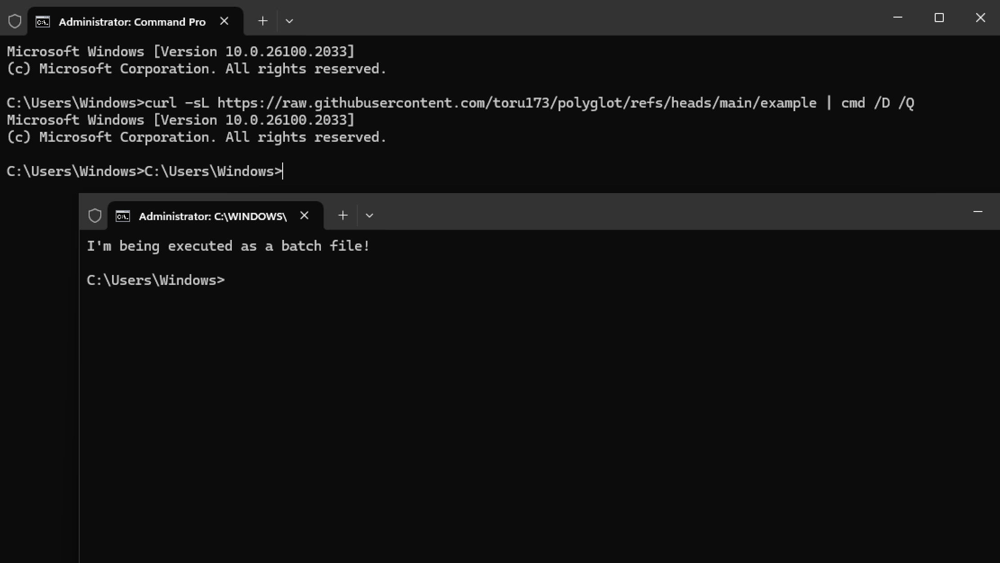
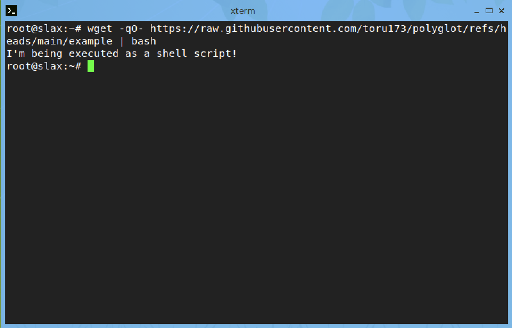
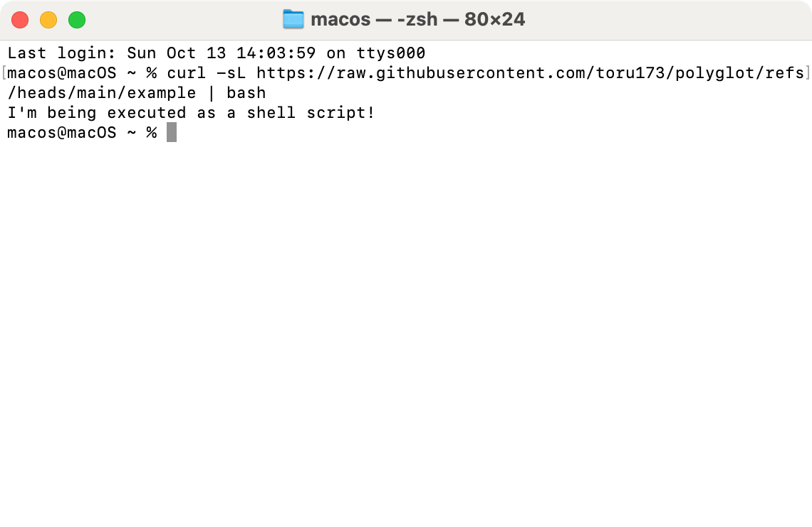
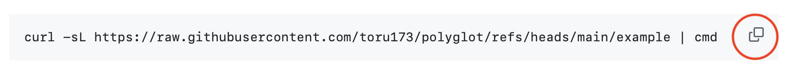

# Polyglot: Simultaneously Valid batch and shell Scripts

## Introduction
Polyglot is a script format that is simultaneously a valid Batch (.BAT, .CMD) file able to be executed on Windows and a valid shell script (bash, sh etc) that can be executed on *nix platforms.

### What is a Polyglot?
In computing, a polyglot is a program or script that is valid in multiple programming languages. [Wikipedia](https://en.wikipedia.org/wiki/Polyglot_(computing)) has a good introduction to the concept.

### Running a polygot script in Windows...


### Linux...


### And in macOS!


## How does it work?
We can combine the two because a line starting with `:` is seen as a label in cmd.exe and a no-op (or 'true') in most shells [as explained here](https://unix.stackexchange.com/questions/31673#39678). When executing in a Bourne (or Bourne-alike) shell, a quoted [heredoc](https://en.wikipedia.org/wiki/Here_document) is used to capture the output of the script up to the delimiter and direct it to `:`, effectivly hiding that content. Quoting the heredoc is important to ensure the shell doesn't attempt to [expand](https://en.wikipedia.org/wiki/Here_document#Unix_shells) any of the script contents. When executing in a Windows cmd.exe environment the first line is seen as a possible target for a `goto` statement, though never referenced.

A simple example polyglot is as follows:

```
: << 'END_WIN'
:: This is the Windows part of the script
ECHO I'm being executed as a batch file!
EXIT /B
END_WIN

# Now we're in the sh (or similar) part of the script.
echo "I'm being executed as a shell script!"
exit 0
```
## Limitations
Batch files behave very differently when being piped to cmd.exe as opposed to being run directly; see this [stack overflow](https://stackoverflow.com/questions/8192318#8194279) article for more information. The best approach appears to be running the script locally when possible using `start example`. This can be done programmatically if attempting to execute the script via cURL by detecting that the script is being piped to cmd.exe and downloading the script to disk to execute from there:

```
SET "TEMP_INSTALL_SCRIPT=%TEMP%\%RANDOM%-%RANDOM%.cmd"
TIMEOUT /T 0 >NUL 2>NUL
IF ERRORLEVEL 1 (curl -sL https://raw.githubusercontent.com/toru173/polyglot/refs/heads/main/example.cmd -o %TEMP_INSTALL_SCRIPT% && START /WAIT /I CMD /K %TEMP_INSTALL_SCRIPT% >NUL 2>&1 & DEL %TEMP_INSTALL_SCRIPT% && EXIT /B)
```

Additionally, batch file labels may not work reliably when [using LF line endings only](https://www.dostips.com/forum/viewtopic.php?t=8988) and bash (or sh) [doesn't like CRLF line endings](https://unix.stackexchange.com/questions/577663/handling-bash-script-with-crlf-carriage-return-in-linux-as-in-msys2). `adjust_line_endings.py` inserts the correct line endings for each section. The heredoc is also sensitive to this; the delimiter must include the carriage return in both cases.

It is critical that Git doesn't try to normallise the line endings of any polyglot script. The script name needs to be added to .gitattributes to disable line ending normalisation:

```
example.cmd -text
```

## Compatibility
Windows will only recognise this file as executable if the extension is `.bat` or `.cmd`, but due to some [ancient voodoo](http://www.faqs.org/faqs/unix-faq/faq/part3/section-16.html) most *nix kernels will likely attempt to execute a text file that is marked as 'executable' by passing it to `sh`. If `sh` has enough functionality for our needs or we are happy to re-launched the script with our preferred shell, we can omit the typical (shebang)[https://en.wikipedia.org/wiki/Shebang_(Unix)] and trust the kernel to continue to behave the way it has for over 45 years.

## Why did you do this?
I have a project that benefits from having a single script that behaves differently (but correctly) depending on the platform it runs on. I spent far too much time learning about different ways to implement this solution and decided to share my knowledge!

## Try it yourself!
This repository contains an [example script](https://raw.githubusercontent.com/toru173/polyglot/refs/heads/main/example.cmd). You can run it on either Windows or macOS/Linux by copying and pasting these commands into your platform's command line interpreter.

### Mini Tutorial
You can quickly copy example code from GitHub by clicking the clipboard icon to the right of the code:



Don't try to copy and past the picture though - you won't get very far!

### Windows
```
curl -sL https://raw.githubusercontent.com/toru173/polyglot/refs/heads/main/example.cmd | cmd
```

### macOS or Linux
```
curl -sL https://raw.githubusercontent.com/toru173/polyglot/refs/heads/main/example.cmd | bash
```

Please quickly read through the [example script](https://raw.githubusercontent.com/toru173/polyglot/refs/heads/main/example.cmd) before downloading as it's never a good idea to blindly download and run code from the internet!

## Contributing or Feedback
If you have questions, comments or feedback, please [open an issue](https://github.com/toru173/polyglot/issues/new/choose) to start the conversation!
